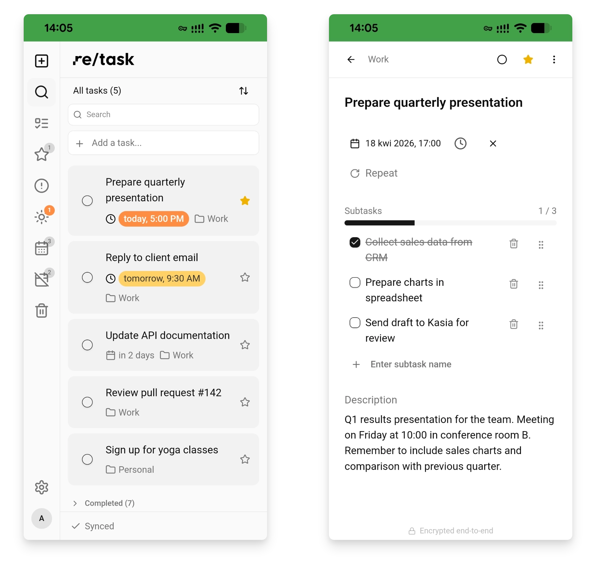
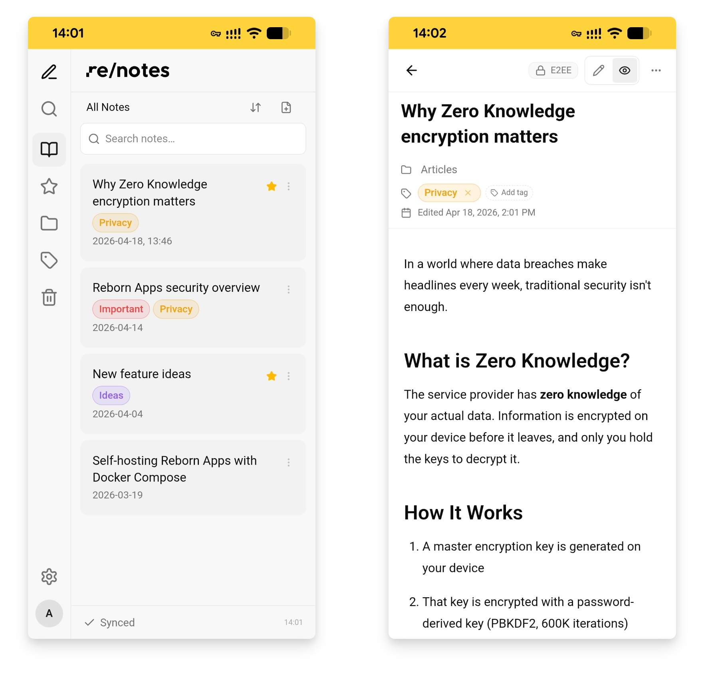

<p align="center">
  
</p>

<h3 align="center">Private. Encrypted. Yours.</h3>

<p align="center">
  Open-source, end-to-end encrypted productivity apps.<br>
  Your data never leaves your device unencrypted.
</p>

<p align="center">
  <a href="https://reapps.eu/task">Try re/task</a> · <a href="https://reapps.eu/notes">Try re/notes</a> · <a href="https://reapps.eu">Website</a>
</p>

<p align="center">
  <a href="LICENSE"></a>
  
  
  <a href="https://stats.uptimerobot.com/JDB9dZbrRv"></a>
  <a href="https://stats.uptimerobot.com/JDB9dZbrRv"></a>
</p>

---

**Reborn Apps** is a suite of two Progressive Web Apps built with a **Zero Knowledge architecture** - all user data is encrypted on your device before it ever reaches the server. The server stores only ciphertext and cannot read your tasks, notes, or metadata.

Built by [Reborn Foundation](https://reborn.org.pl) (Poland), a European non-profit. Hosted on Hetzner Cloud (Germany). No tracking, no ads, no email required.

## Apps

### re/task - Encrypted task management

<p align="center">
  
</p>

- **Task lists**
- **Subtasks** with progress tracking
- **Recurring tasks** - daily, weekly, or custom schedule
- **Starred & favorites** - focus on what matters
- **Due dates & reminders** with optional push notifications - delivered even when the app is closed via an opt-in server-assisted pipeline that learns *when* a reminder fires (bucketed to 5 minutes), never *what* it is for ([design doc](docs/security/push-notifications.md))
- **Smart views** - Today, Upcoming, Overdue, Starred, Completed
- **Full-text search** with operators - `list:Inbox`, `due:<7d`, `is:overdue`, `has:link`, … ([reference](docs/search-operators.md))
- **Trash & recovery** - restore deleted tasks within 30 days
- **Import & export** - JSON backup and restore
- **Read-only share links** - send a frozen snapshot of a task (with its subtasks) via an encrypted public URL; the snapshot key lives in the URL fragment so the server never sees it. Optional password, expiry, and view-count limit; revoke anytime ([blog post](https://reapps.eu/blog/sharing-notes-tasks-zero-knowledge-snapshots/)).

### re/notes - Encrypted notes & documents

<p align="center">
  
</p>

- **Markdown editor** - headings, lists, code blocks, images, and more
- **Folders & tags** - flexible organization system
- **Multi-select & bulk actions** - pin, star, move to folder, or delete many notes at once (long-press on touch, header toggle on desktop)
- **Periodic notes** - one-click Daily, Weekly, and Monthly notes (Obsidian-style); date-based titles with configurable formats, lazy-created folders, Daily on by default ([blog post](https://reapps.eu/blog/periodic-notes-daily-weekly-monthly))
- **Version history** - up to 10 saved versions per note
- **Internal links** - link between notes with autocomplete to build a knowledge base
- **Live preview** - edit Markdown on one side, see formatted output on the other
- **Encryption X-Ray** - see exactly what the server sees (encrypted blobs)
- **Full-text search** with operators - `tag:work`, `folder:projects/active`, `created:<7d`, `has:link`, `-tag:archived`, … ([reference](docs/search-operators.md))
- **Trash & recovery** - safely delete and restore notes
- **Import & export** - Markdown, JSON, or encrypted backup; import single `.md` files or entire folders with subfolders (e.g., an Obsidian vault) preserving directory structure
- **Local folder sync** - link a folder of Markdown files on your disk and changed files are re-imported (and encrypted) automatically; one-way disk → app, never deletes notes (Chromium-based browsers)
- **Read-only share links** - publish a frozen snapshot of a note via an encrypted public URL; the snapshot key lives in the URL fragment so the server never sees it. Optional password, expiry, and view-count limit; revoke anytime ([blog post](https://reapps.eu/blog/sharing-notes-tasks-zero-knowledge-snapshots/)).

### Shared features

- 🔐 **End-to-end encryption** - data is encrypted on your device before reaching any server
- 📱 **Offline-first PWA** - works without internet, syncs when back online
- 🔄 **Cross-device sync** - access from any device, changes sync automatically
- 🛡️ **Two-factor authentication** - TOTP (2FA) with one-time recovery codes
- 👤 **One account, no email** - just a username and password, shared across both apps (SSO)
- 🌍 **Installable** - add to home screen as a native-like app
- 🌙 **Dark mode** - full dark theme support
- � **Multilingual** - English 🇬🇧, French 🇫🇷, German 🇩🇪, Polish 🇵🇱, Spanish 🇪🇸

## Security & privacy

Reborn Apps uses a **Zero Knowledge E2E architecture**:

| What | Where | Who can read it |
|---|---|---|
| Tasks, notes, subtasks, metadata | Server (encrypted) | **Only you** |
| Username | Server (plaintext) | Server operator |
| Password | Server (Argon2id hash) | **Nobody** |
| Encryption keys | Your device only | **Only you** |
| Email, phone, real name | **Not collected** | - |

**How it works:**

1. You set a password → a master encryption key is derived on your device (PBKDF2 600K iterations)
2. All data is encrypted with AES-256-GCM before leaving the browser
3. The server stores only ciphertext - it cannot decrypt anything
4. Even sensitive metadata (due dates, completion status, starred flags) is bundled into an encrypted blob
5. If the server is compromised, attackers get only encrypted noise

> ⚠️ **If you forget your password, your data is irrecoverable.** Recovery codes cannot help with password recovery - they only bypass 2FA if you lose access to your authenticator app. This is by design - the server cannot help you because it cannot read your data.

For a deep dive, see the [Zero Knowledge Architecture](docs/architecture/zero-knowledge-architecture.md) document and the [Security Overview](docs/security/security-overview.md).

## Try it

A free public instance is available at **[reapps.eu](https://reapps.eu)**, maintained by [Reborn Foundation](https://reborn.org.pl):

| App | URL |
|---|---|
| re/task | [reapps.eu/task](https://reapps.eu/task) |
| re/notes | [reapps.eu/notes](https://reapps.eu/notes) |

No email required. Create an account with just a username and password.

**Live status:** [stats.uptimerobot.com/JDB9dZbrRv](https://stats.uptimerobot.com/JDB9dZbrRv)

## Self-hosting

You own your data - you can also run your own instance.

There are two flows depending on what you want to do:

| Flow | Source on host? | Image | Speed | Use case |
|---|---|---|---|---|
| [Development](#development-flow) | Required (cloned repo) | `node:alpine` + bind mount + `pnpm install` at boot | Slow first start, HMR after | Hacking on the code |
| [Production](#production-flow) | Not required at runtime | Pre-built from multi-stage `Dockerfile` | <15 s boot, no install | Running your own instance |

> **Why this matters:** the default `docker-compose.yml` is the **development** flow. If you paste it into a stack editor (Portainer, Coolify, …) without a cloned repo on the host, `pnpm install` fails with `ERR_PNPM_NO_PKG_MANIFEST` because the bind mount points at an empty directory. For self-hosting, use the production flow below.

### Requirements

- [Docker](https://docs.docker.com/get-docker/) v25+ with Docker Compose
- A `.env` file (copy from `.env.example`, generate strong secrets - see below)

### Development flow

```bash
# Clone the repository
git clone https://github.com/fundacja-reborn/reapps.git
cd reapps

# Copy environment config
cp .env.example .env

# Start both apps with SSO support (recommended)
docker compose -f docker-compose.yml -f docker-compose.proxy.yml --profile with-notes up
```

After startup:

| App | URL |
|---|---|
| re/task | http://localhost/task |
| re/notes | http://localhost/notes |

Both apps share a single PostgreSQL database and a single user account (SSO via shared origin).

> First startup takes a few minutes (downloading images + `pnpm install`). Subsequent starts are fast thanks to Docker volume caching.

#### Other dev configurations

```bash
# Only re/task (port 4200)
docker compose up

# Both apps on separate ports (no SSO)
docker compose --profile with-notes up
```

### Production flow

The production flow builds a multi-stage `Dockerfile` and runs the pre-compiled SvelteKit server - no `pnpm install` at boot, no bind mount, no source on the host required at runtime.

```bash
git clone https://github.com/fundacja-reborn/reapps.git
cd reapps

# Copy and edit the environment + production override.
cp .env.example .env
cp docker-compose.prod.yml.example docker-compose.prod.yml
```

Edit `.env` and set at least:

```bash
PUBLIC_SITE_URL=https://your-domain.example.com   # or http://your-server-ip
DB_USER=postgres
DB_PASSWORD=<strong-random-password>
DB_NAME=reborn
JWT_SECRET=<32+ random bytes, base64>
REFRESH_TOKEN_SECRET=<32+ random bytes, base64>
SESSION_SECRET=<32+ random bytes, base64>
RECOVERY_KEY_SECRET=<32+ random bytes, base64>
```

Generate a secret with `openssl rand -base64 48`.

Build and start:

```bash
docker compose -f docker-compose.yml -f docker-compose.prod.yml \
  --profile with-notes up -d --build --wait
```

The apps listen on `:4200` (task) and `:4201` (notes) on the Docker host. For SSO (shared origin → shared localStorage) put a TLS-terminating reverse proxy in front (nginx, Caddy, Traefik, Cloudflare Tunnel, …) that maps:

- `<PUBLIC_SITE_URL>/task/`  → `http://127.0.0.1:4200/task/`
- `<PUBLIC_SITE_URL>/notes/` → `http://127.0.0.1:4201/notes/`

`nginx/dev.conf` is a reference proxy config - adapt it (add `listen 443 ssl;`, certificate paths, HSTS) for your environment.

> **Portainer / Coolify / stack editors:** paste the contents of `docker-compose.yml` **and** `docker-compose.prod.yml.example` (combined or as a compose project that fetches both from git). The build context needs the repo source - point the stack at this Git URL, not at a raw paste.

#### Smoke-testing the production image locally

If you want to verify the production build works **before** pointing your real domain at it:

```bash
cp docker-compose.localprod.yml.example docker-compose.localprod.yml

docker compose -f docker-compose.yml -f docker-compose.localprod.yml \
  -f docker-compose.proxy.yml --profile with-notes -p reborn-localprod \
  up -d --build --wait
# → http://localhost/task and http://localhost/notes
```

This uses `http://localhost` as the origin and the dev DB credentials, so it composes cleanly without further configuration.

### Without Docker

```bash
# Prerequisites: Node.js 20+, PNPM 10+, PostgreSQL

pnpm install
pnpm db:generate
pnpm db:migrate

# Start re/task
pnpm nx dev reborn-task

# Start re/notes (separate terminal)
pnpm nx dev reborn-notes
```

### Stopping & cleanup

```bash
# Stop containers (dev)
docker compose -f docker-compose.yml -f docker-compose.proxy.yml --profile with-notes down

# Stop containers (production)
docker compose -f docker-compose.yml -f docker-compose.prod.yml --profile with-notes down

# Full reset (removes database and cached node_modules)
docker compose -f docker-compose.yml -f docker-compose.proxy.yml --profile with-notes down -v
```

## Tech stack

| Layer | Technology |
|---|---|
| Frontend | SvelteKit 2, Svelte 5 (runes), TypeScript |
| Styling | TailwindCSS 4 |
| Offline storage | IndexedDB (Dexie.js) |
| Encryption | AES-256-GCM, PBKDF2, Argon2id (Web Crypto API + hash-wasm) |
| Backend | SvelteKit API routes |
| Database | PostgreSQL 17, Prisma 6 |
| Auth | JWT + refresh tokens, TOTP 2FA, recovery codes |
| Monorepo | pnpm workspaces, Nx 21 |
| Notes editor | CodeMirror 6 (Markdown) |

## Project structure

```
apps/
├── reborn-task/         # Task management app (SvelteKit)
└── reborn-notes/        # Notes app (SvelteKit)
packages/
├── @reborn/auth         # Authentication (JWT, 2FA, recovery codes)
├── @reborn/crypto       # E2E encryption & key management
├── @reborn/database     # Prisma schema & client
├── @reborn/storage      # Encrypted IndexedDB stores
├── @reborn/types        # Shared TypeScript types
├── @reborn/ui           # UI components (shadcn-svelte)
├── @reborn/i18n         # Internationalization (PL/EN)
├── @reborn/utils        # Shared utilities
└── @reborn/api-client   # HTTP client for API
docs/
├── architecture/        # Zero Knowledge architecture docs
└── security/            # Security audits
```

## Contributing

We welcome community involvement! Due to the security-sensitive nature of this project (E2E encryption, Zero Knowledge architecture), we maintain all code changes internally.

**How you can help:**

- **Report bugs** - [open an Issue](https://github.com/fundacja-reborn/reapps/issues) with clear reproduction steps
- **Suggest features & discuss ideas** - join [GitHub Discussions](https://github.com/fundacja-reborn/reapps/discussions)
- **Report security vulnerabilities** - see our [Security Policy](SECURITY.md) (please report privately)
- **Improve translations** - suggest corrections or new languages via Issues

> **Note:** We do not accept external pull requests. Every code change undergoes internal security review to protect the integrity of the encryption layer. If you've found a bug and know the fix, please describe it in an Issue - we'll gladly credit you. See [CONTRIBUTING.md](CONTRIBUTING.md) for the full policy and the reasoning behind it.

## Acknowledgments

Reborn Apps is shaped by feedback from people who try it, share ideas, and tell us what's missing. Special thanks to:

- **[Travis Solin (@computrav)](https://github.com/computrav)** - for early feedback on the public release and detailed thinking on power-user search semantics that directly informed the operator-based search syntax.

If you've contributed something that shaped this project - an idea, a substantive bug report, a translation - and you're not listed here, please [open an Issue](https://github.com/fundacja-reborn/reapps/issues). Smaller individual reports are credited per-release in commit messages and release notes.

## License

[AGPL-3.0](LICENSE) - Copyright © 2025-2026 Fundacja Reborn (Poland)

You are free to use, modify, and self-host. If you modify the server-side code and offer it as a service, you must open-source your changes under the same license.

Bundled third-party components and our dual-license elections are documented in [THIRD-PARTY-NOTICES.md](THIRD-PARTY-NOTICES.md). App-store builds additionally carry an [app store distribution exception](LICENSE-EXCEPTIONS.md) (an AGPL-3.0 §7 additional permission), so that forks can also be published through the stores.

## Further reading

- [Zero Knowledge Architecture](docs/architecture/zero-knowledge-architecture.md) - how encryption works under the hood
- [Security Overview](docs/security/security-overview.md) - security posture, cryptographic primitives, and known limitations
- [Push Notifications - Zero Knowledge Design](docs/security/push-notifications.md) - threat model and opt-in trade-off for server-assisted reminders
- [Read-only Snapshot Sharing - Zero Knowledge Design](docs/security/read-only-snapshot-sharing.md) - how public share links keep the server blind
- [Security Policy](SECURITY.md) - how to report vulnerabilities

## Support

Reborn Apps is built by a non-profit foundation - no investors, no ads, no tracking. If you find our apps useful and want to support their continued development, every donation helps us build software free from commercial pressure.

→ [**Donate via Wise**](https://wise.com/pay/business/fundacjareborn?description=Donation+-+statutory+purposes)

→ [**More ways to support**](https://reapps.eu/#support)

---

Built with privacy in mind by [Reborn Foundation](https://reborn.org.pl) (Poland).
